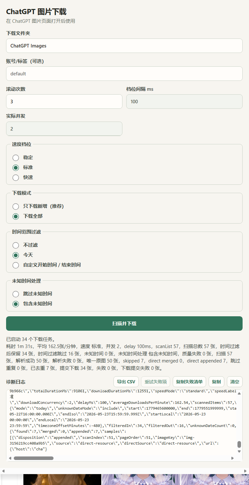

# ChatGPT Image Downloader

一个用于批量下载 ChatGPT 生成图片的 Chrome / Edge 浏览器扩展。

如果你经常在 ChatGPT 里生成图片，想把自己生成过的图片批量保存到本地，而不是一张一张手动点开、另存为，这个插件可以帮你自动扫描当前 ChatGPT 页面，尽量解析原图地址，并批量提交给浏览器下载。

## 它解决什么问题？

ChatGPT 生成图片多了以后，手动下载会很麻烦：

- 一张一张点开保存很慢；
- 聊天记录里图片很多，不方便批量整理；
- 浏览器图片下载插件可能只能拿到缩略图；
- 不同日期、不同账号、不同用途的图片容易混在一起；
- 已经下载过的图片容易重复下载。

这个扩展的目标是：

> 从你自己的 ChatGPT 页面中批量扫描生成图片，尽量下载大图/原图，并按日期、账号/标签和任务 ID 整理到本地文件夹。

## 适合谁使用？

适合这些用户：

- 经常用 ChatGPT 生成图片；
- 一天会生成很多张图，需要批量保存；
- 想按日期整理图片；
- 想跳过已经下载过的图片；
- 想保留失败清单和诊断日志，方便后续排查。

不适合这些情况：

- 想下载别人账号里的图片；
- 想绕过 ChatGPT 权限限制；
- 想自动打包 ZIP；
- 想读取 ChatGPT 页面里没有加载出来的历史图片。

## 快速开始

1. 点击本仓库右上角绿色按钮 **Code**。
2. 选择 **Download ZIP**。
3. 解压 ZIP。
4. 打开 Chrome / Edge 扩展管理页面：
   - Chrome：`chrome://extensions`
   - Edge：`edge://extensions`
5. 打开右上角 **开发者模式**。
6. 点击 **加载已解压的扩展程序**。
7. 选择解压后的项目根目录，也就是包含 `manifest.json` 的文件夹。
8. 打开或刷新 `https://chatgpt.com/`。
9. 点击浏览器工具栏里的扩展图标。
10. 点击 **扫描并下载**。

## 使用流程

```text
打开 ChatGPT 图片页面或包含图片的会话
→ 点击扩展图标
→ 设置下载文件夹、滚动次数、时间范围
→ 点击“扫描并下载”
→ 插件自动滚动页面、解析图片、提交下载任务
→ 下载完成后查看统计、失败清单或导出 CSV
```

## 插件截图

